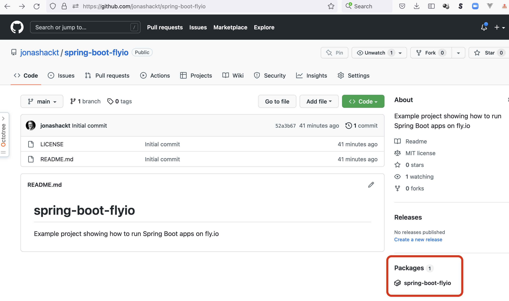
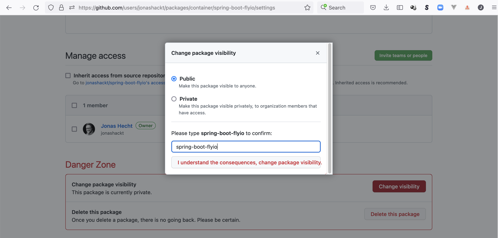
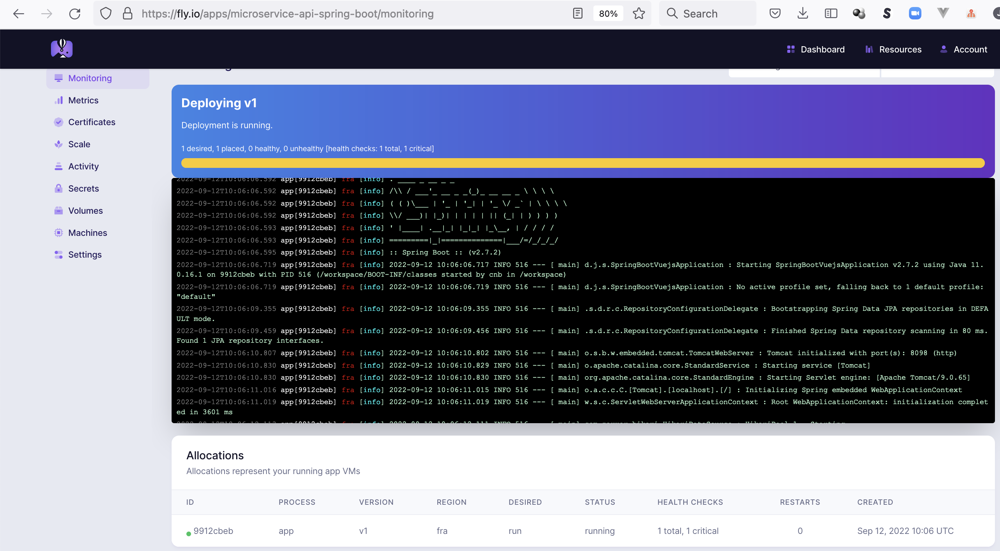
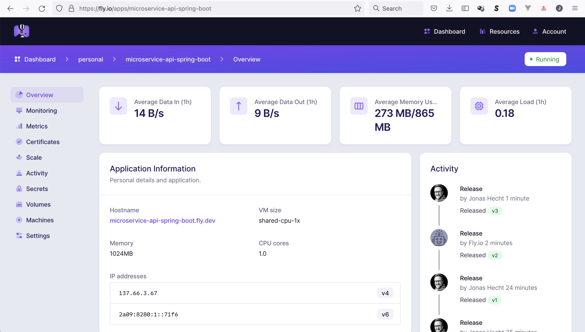
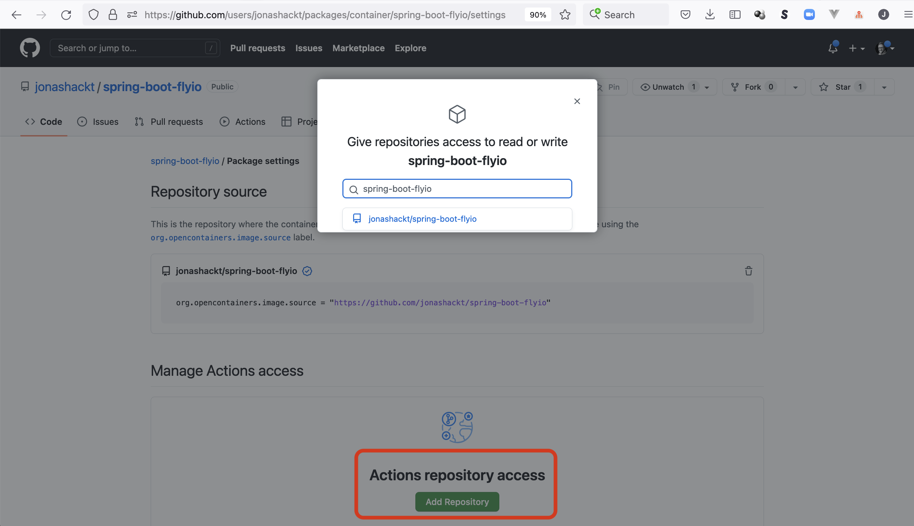
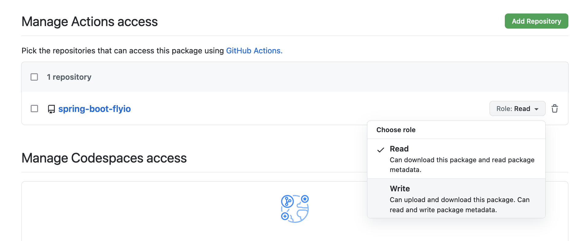
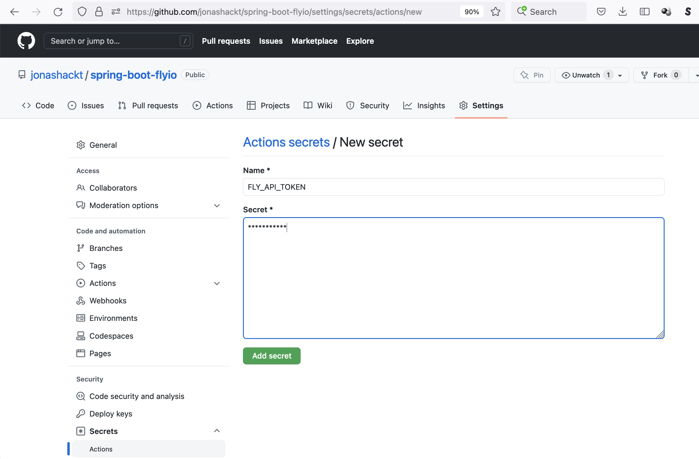

# spring-boot-flyio
[](https://github.com/jonashackt/spring-boot-flyio/actions)
[](https://renovatebot.com)
[](https://github.com/spring-projects/spring-boot)

Example project showing how to run Spring Boot apps on https://fly.io/

## Why?

In late August Heroku announced their cancellation of their free plan for Heroku Dynos, Heroku Postgres and Heroku Data for Redis: https://blog.heroku.com/next-chapter

Looking at my Heroku dashboard there's also a new warning now stating that I need to upgrade to a paid plan for my apps before November 28th.


I always loved Heroku for it's simplicity and used it in a lot of my blog posts, where I used it to deploy my example projects on GitHub in a super comprehensive way. I even dedicated some posts solely to Heroku https://blog.codecentric.de/en/2019/08/spring-boot-heroku-docker-jdk11/ and some of my best voted stackoverflow answers feature Heroku as well (e.g. "Connecting to Heroku Postgres from Spring Boot" https://stackoverflow.com/a/49978310/4964553).

Finally I often introduced Heroku to my students in my lectures at University of Applied Sciences Erfurt or Bauhaus University Weimar, where all the students had a running app (in Heroku) at the end of the first lessons.


## Fly.io to the rescue - but only with Buildpack support!

So what alternatives do we have? On a occasional team Friday some weeks ago my colleague Daniel entered the discussion about Heroku alternatives with: why not use https://fly.io/ ?! Ok, I said - never heard of it. It has been announced in March 2020 https://news.ycombinator.com/item?id=22616857 as:

> fly.io is really a way to run Docker images on servers in different cities and a global router to connect users to the nearest available instance. We convert your Docker image into a root filesystem, boot tiny VMs using an Amazon project called Firecracker, and then proxy connections to it. As your app gets more traffic, we add VMs in the most popular locations.

But does it support Buildpacks? I asked him. Since Heroku is the inventor of Cloud Native Buildpacks and they belong to my standard toolbelt for around 2 years now https://blog.codecentric.de/en/2020/11/buildpacks-spring-boot/ I really don't want to miss them again. And yes, Fly.io seems to support Buildpacks https://fly.io/blog/deno-on-fly-using-buildpacks/. So why not start a small Dev Friday and have a look at fly.io in detail? My colleague Andreas started using a Go project, I opted for a Spring Boot based project and started fresh via https://start.spring.io/:


## HowTo

So why not start using fly.io by checking out their hands-on guide at https://fly.io/docs/hands-on/


### Install flyctl

https://fly.io/docs/hands-on/install-flyctl/

On a Mac install flyctl via brew:

```shell
brew install flyctl
```


### Signup or login to fly.io

https://fly.io/docs/hands-on/sign-up/ or https://fly.io/docs/hands-on/sign-in/

```shell
fly auth signup
```


### Build example Spring Boot app with Paketo

As stated in https://fly.io/docs/hands-on/launch-app/

> Fly.io allows you to deploy any kind of app as long as it is packaged in a Docker image. That also means you can just deploy a Docker image and as it happens we have one ready to go in flyio/hellofly:latest.

That means you can use the proposed command `flyctl launch --image flyio/hellofly:latest` - but this would only launch a pre-build app based on the fly.io image flyio/hellofly https://hub.docker.com/r/flyio/hellofly

But as we want to use our own Spring Boot project at https://github.com/jonashackt/spring-boot-flyio we need to create a Docker image first. 

That's easy using Cloud Native Buildpack support in Spring Boot https://blog.codecentric.de/en/2020/11/buildpacks-spring-boot/. 

But using pack CLI https://buildpacks.io/docs/tools/pack/ directly makes that a lot easier. With pack we can re-use our login to the Docker registry we want to publish to on the command line. And as the Docker Hub introduced a rate limiting I always love to use the GitHub Container Registry in my projects https://blog.codecentric.de/en/2021/03/github-container-registry/. Be sure to have done a login to GitHub Container Registry https://docs.github.com/en/packages/working-with-a-github-packages-registry/working-with-the-container-registry#authenticating-to-the-container-registry before running the following pack CLI command to build our Spring Boot app into a Docker image: 

```shell
pack build ghcr.io/jonashackt/spring-boot-flyio:latest \
    --builder paketobuildpacks/builder:base \
    --path . \
    --env "BP_OCI_SOURCE=https://github.com/jonashackt/spring-boot-flyio" \
    --env "BP_JVM_VERSION=17" \
    --publish
```

There are two additional parameters here: The `BP_OCI_SOURCE` as --env parameter creates the GitHub Container Registry <-> Repository link (https://paketo.io/docs/buildpacks/configuration/#applying-custom-labels) and the `BP_JVM_VERSION` 17, because we use Java 17 inside our Maven build but Paketo defaults to 11.


Having a local Docker daemon running this should bundle our project into a Dockerfile like this:

```shell
...
Saving ghcr.io/jonashackt/spring-boot-flyio:latest...
*** Images (sha256:59f2bf1f186f6d837d211c544dfbc342817ebb94f9776e918973a0ebcc2a4163):
      ghcr.io/jonashackt/spring-boot-flyio:latest
Reusing cache layer 'paketo-buildpacks/bellsoft-liberica:jdk'
Reusing cache layer 'paketo-buildpacks/syft:syft'
Reusing cache layer 'paketo-buildpacks/maven:application'
Reusing cache layer 'paketo-buildpacks/maven:cache'
Reusing cache layer 'paketo-buildpacks/maven:maven'
Reusing cache layer 'cache.sbom'
Successfully built image ghcr.io/jonashackt/spring-boot-flyio:latest
```

Having a look into the package view of our repository we should be able to see the new image published:



Before we can actually use this image with fly.io, we have to make it publicly accessible. This is just needed once - and its only because the default visibility for container images on the GitHub Container Registry is private.

So head over to the package settings of your GitHub Container Registry image (the package settings live in https://github.com/users/yourOrgaName/packages/container/yourRepositoryName/settings) and scroll down to the `Danger Zone` and click on `change visibility`:



Now we should finally have our image publicly available and should be able to deploy our Spring Boot app on fly.io using `flyctl` like this:

```shell
fly launch --image ghcr.io/jonashackt/spring-boot-flyio:latest
```

This command will ask a few questions at first (region, app name, etc) and then deploy our Spring Boot app.


### Alternative image building: Via Maven or Buildpacks support in flyctl

There are a few alternatives to using Paketo and the pack CLI. For example we can use Maven and it's `mvn spring-boot:build-image` command. Since fly CLI `launch --image` command per default wants to deploy a Docker image that was pushed to a dedicated registry before, we also need to publish our image. Therefore we can add the `-Dspring-boot.build-image.publish` parameter as stated in the docs https://docs.spring.io/spring-boot/docs/current/maven-plugin/reference/htmlsingle/#build-image.examples.publish . But using this parameter we also would have to configure a `<publishRegistry>` tag inside our `pom.xml`. If that's to much of configuration, we could also use the Fly.io registry instead of the GitHub Container registry and simply publish the locally build image there. This can be accomplished leveraging the `--local-only` fly CLI paramter like this:

```shell
fly deploy --local-only --image jonashackt/spring-boot-flyio
```

This will upload the image tagged `jonashackt/spring-boot-flyio` to the fly.io registry.


Another way of building the image yourself would be to hand it over to fly CLI. But as opposed to what's stated in the docs https://fly.io/docs/reference/configuration/#the-build-section we do not need to add a `buildpacks` configuration to our `fly.toml`.

Instead we simply override the generated `image` configuration inside the `fly.toml`:

```toml
[build]
  image = "ghcr.io/jonashackt/spring-boot-flyio:latest"
```

and simply use the `builder` tag only like this (as stated in this so answer https://stackoverflow.com/a/73688179/4964553):

```toml
[build]
  builder = "paketobuildpacks/builder:base"
```

Now fly CLI will build your app using Cloud Native Buildpacks without you requiring to issue pack CLI commands. And it even publishes the image to the fly.io Docker registry at registry.fly.io/spring-boot-flyio and deploy your app correctly.


### More RAM please!

Our Spring Boot app wasn't deployed successfully sadly. Having a look into the `Monitoring` of our app at https://fly.io/apps/spring-boot-flyio/monitoring we should see the problem leading to a `error unable to calculate memory configuration` error:

```shell
...
 2022-09-12T14:26:28.806 runner[dc01b687] fra [info] Starting virtual machine
2022-09-12T14:26:29.049 app[dc01b687] fra [info] Starting init (commit: 249766e)...
2022-09-12T14:26:29.069 app[dc01b687] fra [info] Preparing to run: `/cnb/process/web` as 1000
2022-09-12T14:26:29.083 app[dc01b687] fra [info] 2022/09/12 14:26:29 listening on [fdaa:0:938e:a7b:66:dc01:b687:2]:22 (DNS: [fdaa::3]:53)
2022-09-12T14:26:29.137 app[dc01b687] fra [info] Setting Active Processor Count to 1
2022-09-12T14:26:29.215 app[dc01b687] fra [info] Calculating JVM memory based on 195468K available memory
2022-09-12T14:26:29.215 app[dc01b687] fra [info] For more information on this calculation, see https://paketo.io/docs/reference/java-reference/#memory-calculator
2022-09-12T14:26:29.215 app[dc01b687] fra [info] unable to calculate memory configuration
2022-09-12T14:26:29.215 app[dc01b687] fra [info] fixed memory regions require 386229K which is greater than 195468K available for allocation: -XX:MaxDirectMemorySize=10M, -XX:MaxMetaspaceSize=79029K, -XX:ReservedCodeCacheSize=240M, -Xss1M * 50 threads
2022-09-12T14:26:29.216 app[dc01b687] fra [info] ERROR: failed to launch: exec.d: failed to execute exec.d file at path '/layers/paketo-buildpacks_bellsoft-liberica/helper/exec.d/memory-calculator': exit status 1
2022-09-12T14:26:30.073 app[dc01b687] fra [info] Starting clean up. 
```

Our JVM-based app doesn't seem to have enough memory.

But we can fix that and give our app more memory [as stated here](https://community.fly.io/t/out-of-memory-restarts/1629/3): 

```shell
fly scale memory 512
```

Playing around with different (older) Spring Boot apps I also discovered that sometimes you need even more memory. Using 1GB of RAM is mostly enough then by running `fly scale memory 1024`.

This should get us a green running Spring Boot app in the fly.io dashboard:




__WARNING:__ This will get our Spring Boot app running on fly.io - but will also kick us out of the free plan we wanted in the first place when switching over from Heroku! The pricing docs tell us https://fly.io/docs/about/pricing/ that you the following for free:

> Resources included for free:

    Up to 3 shared-cpu-1x 256mb VMs 
    3GB persistent volume storage (total)
    160GB outbound data transfer 

That means upgrading the memory to `512` will cost us $0.0000012/s or $3.19 a month. But maybe we can reduce that memory consumption back to less than 256mbs later again?


### Access our Spring Boot app on fly.io

Our Spring Boot app is now running on fly.io without errors. We can also click on the generated hostname spring-boot-flyio.fly.dev - but that won't open up our app.

There are two reasons for that. First we need to tell fly.io on which port our Spring Boot app want's to be accessed. The port is defined inside the [application.properties](https://github.com/jonashackt/spring-boot-flyio/blob/main/src/main/resources/application.properties) via `server.port=8098`.

Now we need to head over to the generated `fly.toml` in the root directory of our project and change the app's port as stated in the docs https://fly.io/docs/reference/configuration/#the-services-sections

```toml
[[services]]
  http_checks = []
  internal_port = 8098
```

Right inside the `fly.toml` we also need to delete the `force_https = true` configuration inside the `[[services.ports]]` section. No fear this won't deactivate https in any way, but will enable us to access our Spring Boot app.

```toml
  [[services.ports]]
    # force_https = true
    handlers = ["http"]
    port = 80
```

Now let's refresh our apps configuration by running:

```shell
fly deploy
```

Finally our app should now be accessible to the public:



Just access it at https://spring-boot-flyio.fly.dev/hello


### Automatically publish to GitHub Container Registry with GitHub Actions

In Heroku there was this really nice feature called auto deploys, which deployed a new version of the app when code on GitHub had changed. My first research in the fly.io docs didn't present any auto deploys feature right out of the box. 

But using GitHub we also have GitHub Actions included! So why not simply using an Actions workflow to deploy our app to fly.io on every push?! So let's enhance our example project on GitHub with an Action to build and publish an container image to the GitHub Container Registry first. Let's have a look at the workflow definition in [autodeploy.yml](.github/workflows/autodeploy.yml):

```yaml
name: autodeploy

on: [push]

jobs:
  autodeploy:
    runs-on: ubuntu-latest

    steps:
      - uses: actions/checkout@v2

      - name: Login to GitHub Container Registry
        uses: docker/login-action@v1
        with:
          registry: ghcr.io
          username: ${{ github.actor }}
          password: ${{ secrets.GITHUB_TOKEN }}

      - name: Install pack CLI via the official buildpack Action
        uses: buildpacks/github-actions/setup-pack@v4.8.1

      - name: Build app with pack CLI & publish to GitHub Container Registry
        run: |
          pack build ghcr.io/jonashackt/spring-boot-flyio:latest \
              --builder paketobuildpacks/builder:base \
              --path . \
              --env "BP_OCI_SOURCE=https://github.com/jonashackt/spring-boot-flyio" \
              --env "BP_JVM_VERSION=17" \
              --cache-image ghcr.io/jonashackt/spring-boot-flyio-paketo-cache-image:latest \
              --publish
```

After the usual checkout we use the [docker/login-action](https://github.com/docker/login-action) to login to GitHub Container Registry. In order to be able to use Paketo CLI in our workflow we leverage the [buildpacks/github-actions/setup-pack](https://github.com/buildpacks/github-actions#setup-pack-cli-action) action. Now we can run our already known `pack` CLI command to build our Spring Boot app into a Docker container and push it to the GitHub Container Registry. Additionally to the command we used locally already the parameter `--cache-image` to be able to [have caching of our depenencies in place although running on an ephemeral CI environment](https://stackoverflow.com/a/66598693/4964553).

And there's an additional ingredient we need to get our GitHub Actions build green: per default GitHub Container Registry images (or packages) are not accessible from within an Action. This could lead to errors like this in our Actions:

```shell
 ERROR: failed to : ensure registry read/write access to ghcr.io/jonashackt/spring-boot-flyio:latest
ERROR: failed to build: executing lifecycle: failed with status code: 1
Error: Process completed with exit code 1.
```

To fix that we again need to head over to the package settings of your GitHub Container Registry image (remember they live in https://github.com/users/yourOrgaName/packages/container/yourRepositoryName/settings) and scroll to `Actions repository access`. There we need to click on `Add Repository` and type in our repository name, where a drop down menu should present it like this:



This will give our Action `read` access on the image. Since we also want to push our app's image to the GitHub Container Registry, we also need to explicitely configure `write` access by selecting it:




### Autodeploys to fly.io with GitHub Actions

In order to deploy our successfully build container image that was pushed to GitHub Container Registry we need to create an auth token we can use to deploy to fly.io. Therefor simply run:

```shell
fly auth token
```

Now head over to your GitHub Repository's `Settings` and click on `Secrets/Actions`. Now create a new secret by clicking on `New repository secret`, give it a name like `FLY_API_TOKEN` and insert the token from the command line:



With that token in place we can add some new lines to our GitHub Actions workflow in [autodeploy.yml](.github/workflows/autodeploy.yml). First we add the `FLY_API_TOKEN` as an environment variable so that flyctl can use it for the deployment:

```yaml
...
jobs:
  autodeploy:
    runs-on: ubuntu-latest
    env:
      FLY_API_TOKEN: ${{ secrets.FLY_API_TOKEN }}
...
```

Now we only need to install `flyctl` in GitHub Actions. That's easily done by the official flyctl-actions https://github.com/superfly/flyctl-actions . Finally we simply deploy our application just as we did locally (but with the fully qualified `flyctl` command, since `fly` isn't available in GitHub Actions):

```yaml
      - name: Install flyctl via https://github.com/superfly/flyctl-actions
        uses: superfly/flyctl-actions/setup-flyctl@master
      
      - name: Deploy our Spring Boot app to fly.io
        run: flyctl deploy --image ghcr.io/jonashackt/spring-boot-flyio:latest
```


### Back to the free plan! Native image to the rescue

Remember that we are producing a small bill with our Spring Boot app needing more than the 256MBs of RAM? Isn't there a way to reduce our applications memory footprint?

As you may already noticed I configured the `Spring Native` dependency into our Spring Boot project. This experimental project enables our app to be build into a native image with a much smaller memory footprint based on GraalVM https://blog.codecentric.de/en/2020/05/spring-boot-graalvm/

So how can we build our Spring Boot native image with Paketo? The docs tell us how do do this. There's a parameter called `--env "BP_NATIVE_IMAGE=true"` that'll do the magic https://paketo.io/docs/howto/java/#build-an-app-as-a-graalvm-native-image-application . What's not in the docs: we also need to define the `paketobuildpacks/builder:tiny` builder to take over, since that's the Paketo builder for native images (you can run `pack builder suggest` to list all the builders incl. what they should be used for).

Also we want to use the latest GraalVM version in our build. To accomplish this we can explicitely define the Java Native Image buildpack with the parameter `--buildpack paketo-buildpacks/java-native-image@5.12.0` https://paketo.io/docs/howto/java/#configure-the-graalvm-version . This corresponds to the GraalVM version `21.3`. 

Now our `pack` CLI command in the GitHub Actions workflow [autodeploy.yml](.github/workflows/autodeploy.yml) looks like this:

```yaml
pack build ghcr.io/jonashackt/spring-boot-flyio:latest \
    --builder paketobuildpacks/builder:tiny \
    --buildpack paketo-buildpacks/java-native-image@5.12.0 \
    --path . \
    --env "BP_JVM_VERSION=17" \
    --env "BP_NATIVE_IMAGE=true" \
    --cache-image ghcr.io/jonashackt/spring-boot-flyio-paketo-cache-image:latest \
    --publish
```

We can even run this command locally. Having our image locally (or pull it right from the GitHub Container Registry), we can check how much memory our native image compiled Spring Boot app now consumes. Therefor the `docker stats` command https://docs.docker.com/engine/reference/commandline/stats/ comes in handy:

```shell
docker stats
CONTAINER ID   NAME                 CPU %     MEM USAGE / LIMIT     MEM %     NET I/O           BLOCK I/O       PIDS
18523add6e0c   trusting_diffie      0.00%     19.19MiB / 9.731GiB   0.19%     1.09kB / 0B       147kB / 0B      6
````


With this small footprint it should be safe to scale down to the fly.io free tier again! Let's do this via the command line:

```shell
fly scale memory 256
```

Now that's pretty cool!


# Links

> The fly launch command detects your Dockerfile and builds it. If you have Docker running locally, it builds it on your machine. If not, it builds it on a Fly build machine. Once your container is built, it's deployed!

https://fly.io/docs/languages-and-frameworks/dockerfile/


https://blog.hartleybrody.com/thoughts-on-flyio/